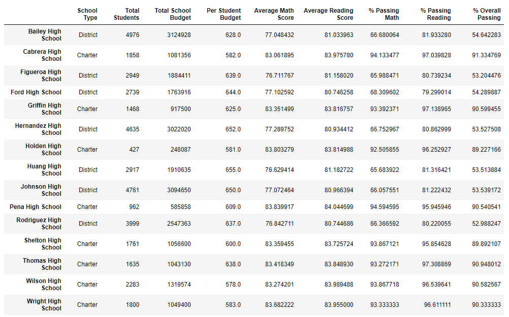
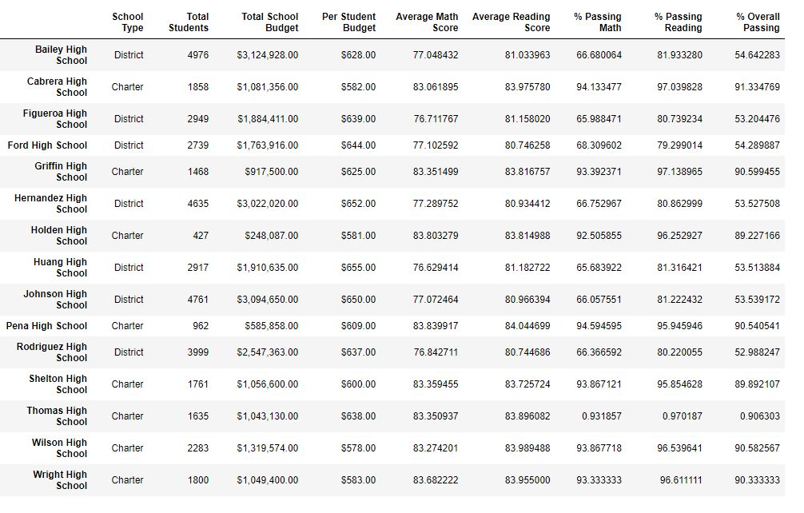

# School_District_Analysis
# PyCitySchools Challenge
## Overview of the school district analysis
	
  This project was initiated to analyze the schools’ data within a district in order to determine if funds needed to be reallocated, based on passing percentages of math and reading scores, as well as student population per school.

### Purpose
	
  The purpose of the challenge part of the analysis was to nullify the tampered data from the Thomas High School 9th grade class and then re-run the analysis with the updates.

## Results 
  - How is the district summary affected?

	The district summary was not affected enough to change the math, reading, or overall passing percentages, when rounded to a whole number.
    
  - How is the school summary affected?

	When adjusting the scores and percentages by nullifying the ninth grade information from Thomas High School, the school's data was slightly affected. The following images will demonstrate the differences. 

Original School Summary

Updated School Summary

- How does replacing the ninth graders’ math and reading scores affect Thomas High School’s performance relative to the other 	schools?
	
	The previous images demonstrate that since removing the ninth grade math and reading scores did not change the overall scores of Thomas High School, their performance compared to other schools remains almost the same. 
	
- How does replacing the ninth-grade scores affect the following:

	- Math and reading scores by grade
		
		Since the math scores of the Thomas ninth grades was already average, the overall 9th grade scores were not affected enough to alter the overall data.  The same can be said for the reading scores.
		
	- Scores by school spending

		The scores by school spending has been the most affected category thus far.  Before nullifying the ninth grade data, the "spending ranges per student" were at $62.9 in the $630-644 bin. After updating the data, the same bin dropped to $40.3 per student.
		
	- Scores by school size

		The scores by school size also showed a signigicant difference after updating the data, specifically, the "medium" size bin.  Before updating the data, the "medium" bin displayed a stat of 90.6 but after, dropped down to 72.6.
		
	- Scores by school type

		Lastly, the scores by school type were also significantly affected in the "charter" category.  The average math and reading scores remained unaffected, but the percentages decreased across the board.  Percentage passing math decreased by 12%, reading by 12%, and overall by 11%.

## Summary

	After adjusting the math and reading scores by removing the ninth grade data, a few categories were affected and other not so much. The school type "charter" data was one of significant note - removing the data dropped the math, ready, and overall scores by an average of 12% in each category. Another change of note was the scores by school size were significantly altered in the "medium" bin, decreasing by 18%.  The last significant change discovered after removing the data, was to the scores by school spending.  Spending decreased by over $22 per student in the $630 range. Lastly, while average scores in math and reading were barely affected, overall percentages in all categories changed significantly. 

  
